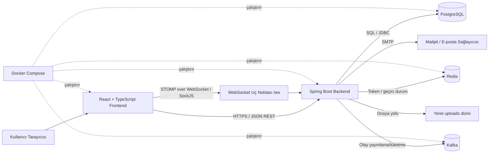
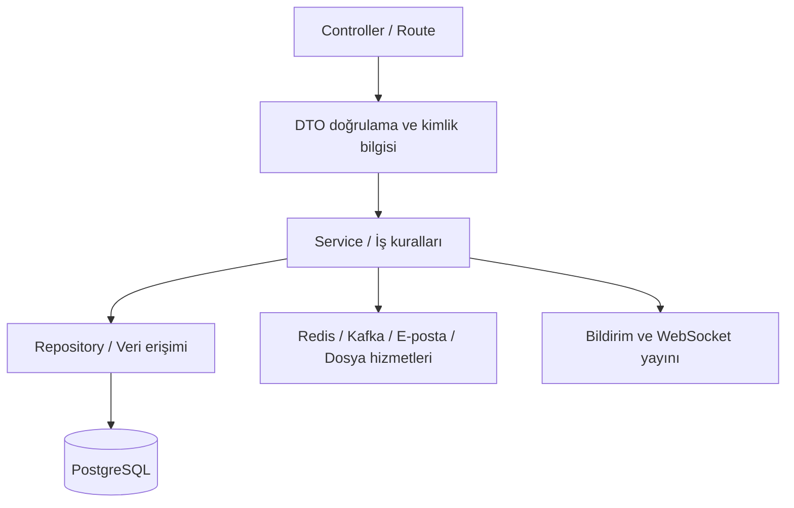
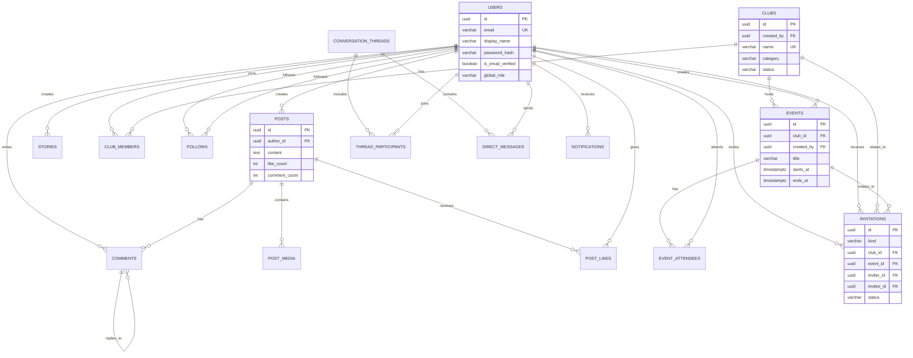

# UniFeed Teknik Dokümanı

| Alan | Bilgi |
| --- | --- |
| Proje | UniFeed – Campus Hub |
| Doküman türü | Teknik Tasarım ve API Sözleşmesi |
| Sürüm | 1.0 |
| Tarih | 16 Ağustos 2026 |
| Kapsam | Web istemcisi, backend API, gerçek zamanlı mesajlaşma, veri katmanı ve geliştirme altyapısı |

## 1. Amaç ve teknik kapsam

Bu doküman UniFeed uygulamasının teknik yapısını tanımlar. Doküman; sistem bileşenlerini, bileşenler arasındaki haberleşmeyi, veritabanı modelini, REST ve WebSocket API sözleşmelerini, güvenlik yaklaşımını, dağıtım ortamını ve geliştirme sürecinde kullanılan yapay zekâ araçlarıyla ilgili kararları içerir.

UniFeed; öğrencilerin profil, sosyal akış, kulüp, etkinlik, bildirim ve doğrudan mesajlaşma ihtiyaçlarını tek bir kampüs platformunda birleştiren istemci–sunucu mimarisine sahip bir web uygulamasıdır.

## 2. Teknoloji yığını

| Katman | Teknoloji | Kullanım gerekçesi |
| --- | --- | --- |
| Web istemcisi | React, TypeScript, Vite | Bileşen tabanlı arayüz, tip güvenliği, hızlı geliştirme ve üretim derlemesi |
| Sunucu | Java 21, Spring Boot | Olgun web/güvenlik ekosistemi, katmanlı servis tasarımı, doğrulama ve WebSocket desteği |
| HTTP API | Spring MVC, JSON/REST | İstemci–sunucu arasında standart, kolay test edilebilir haberleşme |
| Gerçek zamanlı iletişim | Spring WebSocket, STOMP, SockJS | Mesajlaşma olaylarının bağlı istemcilere iletilmesi |
| Ana veritabanı | PostgreSQL 16 | İlişkisel veri bütünlüğü, UUID, JSONB, indeks ve transaction desteği |
| Önbellek/oturum altyapısı | Redis 7 | Yenileme belirteci ve geçici veri ihtiyaçları |
| Asenkron olaylar | Apache Kafka | E-posta, denetim ve sistem günlükleri gibi olay tabanlı işlemleri ayırma |
| E-posta geliştirme ortamı | Mailpit | Yerel ortamda e-posta akışını gerçek harici alıcıya ihtiyaç duymadan test etme |
| Container altyapısı | Docker ve Docker Compose | Bağımlılıkların tekrarlanabilir biçimde çalıştırılması |
| Migration | Flyway SQL migration dosyaları | Veritabanı şemasının sürümlü ve izlenebilir yönetimi |

## 3. Sistem mimarisi

### 3.1. Yüksek seviye mimari şeması



### 3.2. Bileşen sorumlulukları

#### Frontend

Frontend, kullanıcı arayüzünü, yönlendirmeyi, dil metinlerini ve sunucu verisinin ekranda sunulmasını yönetir. React bileşenleri özellik alanlarına göre ayrılır; veri erişimi tekrar eden API çağrılarını ortaklaştıran hook/istemci katmanı üzerinden yapılır. İstemci erişim belirtecini HTTP isteklerinde `Authorization: Bearer <accessToken>` biçiminde iletir.

Başlıca ekran/özellik alanları şunlardır:

- Kimlik doğrulama ve oturum ekranları
- Ana akış ve gönderi bileşenleri
- Profil, takip ve profil listesi modalları
- Kulüp/etkinlik listeleri, ayrıntı sayfaları ve davet denetimleri
- Keşfet ve arama ekranı
- Bildirimler
- Doğrudan mesajlaşma ekranı

#### Backend

Backend, iş kurallarının ve veri güvenliğinin uygulandığı katmandır. HTTP denetleyicileri (controller) istekleri alır; servis katmanı iş kurallarını yürütür; repository/veri erişim katmanı sorguları çalıştırır. Bu ayrım, arayüzün veritabanı ayrıntılarına doğrudan bağlanmasını engeller ve test edilebilirliği artırır.



Başlıca backend modülleri:

| Modül | Sorumluluk |
| --- | --- |
| `auth` | Kayıt, OTP doğrulama, giriş, yenileme, çıkış, şifre sıfırlama |
| `profile` | Profil görüntüleme/güncelleme, profil gönderileri, takipçi/takip/kulüp listeleri |
| `feed` | Ana akış, gönderi oluşturma/okuma/silme, sayfalama |
| `social` | Beğeni, yorum, takip ilişkileri |
| `story` | Süreli hikâye oluşturma, görüntüleme, aktif hikâye sorgusu |
| `club` | Kulüp, üyelik, etkinlik, katılım ve davet yaşam döngüsü |
| `notification` | Bildirim listeleme ve okundu durumu |
| `chat` | Doğrudan konuşmalar, mesaj geçmişi, mesaj gönderme ve STOMP entegrasyonu |
| `search` | Kullanıcı, kulüp ve etkinlik araması |
| `media` | Dosya doğrulama ve medya depolama |
| `common` | Ortak kullanıcı kimliği, istek limitleri ve hata işleme yardımcıları |

### 3.3. İstek yaşam döngüsü

1. Kullanıcı arayüzde bir eylem başlatır; örneğin gönderi oluşturur veya bir etkinliğe katılır.
2. Frontend, JSON gövdeli REST isteğini backend'e yollar ve erişim belirtecini `Authorization` başlığında taşır.
3. Spring Security belirteci doğrular; isteğin kimliği doğrulanmış kullanıcıya ait olup olmadığını kontrol eder.
4. Controller, yolu ve isteği ilgili DTO'ya eşler; gerekli giriş doğrulamasını başlatır.
5. Service iş kuralını uygular; örneğin kullanıcının kulüp yöneticisi olup olmadığını veya bir katılımın zaten bulunup bulunmadığını denetler.
6. Repository/veri erişim katmanı parametrik SQL ile PostgreSQL üzerinde işlemi yapar.
7. Gerekliyse bildirim, e-posta olayı veya WebSocket mesajı üretilir.
8. Backend, istemciye uygun HTTP durum kodu ve JSON yanıtı döner; frontend önbelleğini/ekranını günceller.

## 4. Güvenlik mimarisi

### 4.1. Kimlik doğrulama

- Erişim için kısa ömürlü JWT erişim belirteci kullanılır.
- Yenileme belirteci HTTP-only ve `SameSite=Strict` cookie olarak yönetilir.
- Parolalar düz metin tutulmaz; BCrypt ile özetlenir.
- Korumalı uç noktalar kimliği doğrulanmış kullanıcı gerektirir.
- API, erişim belirtecindeki kullanıcı kimliğini `Authentication`/`Principal` üzerinden alır; istemcinin gövdede kullanıcı kimliği göndermesine güvenmez.

### 4.2. Yetkilendirme

- Kullanıcı yalnızca kendi profilini ve kendi gönderisini değiştirebilir/silebilir.
- Kulüp oluşturma sonrası oluşturan kullanıcı kulüp yöneticisi olur.
- Kulüp daveti ve kulüp altında etkinlik oluşturma işlemlerinde `CLUB_ADMIN` rolü kontrol edilir.
- Mesaj geçmişi, mesaj gönderimi ve okundu işaretleme işlemlerinde konuşma katılımcılığı kontrol edilir.
- Takip, üyelik ve katılım ilişkilerinde tekrarlı kayıtlar veritabanı birincil anahtar/benzersizlik kurallarıyla önlenir.

### 4.3. Girdi ve veri güvenliği

- İstek gövdeleri Spring Validation ile doğrulanır.
- SQL sorguları bağlanmış parametrelerle çalıştırılır; kullanıcı girdisi SQL metnine eklenmez.
- React, kullanıcı metnini varsayılan olarak HTML olarak yorumlamaz; bu yaklaşım istemci tarafı XSS riskini azaltır.
- Medya yüklemelerinde tür ve boyut doğrulaması uygulanır.
- CORS, yapılandırılmış izinli frontend kökenleriyle sınırlıdır; kimlik bilgisi gerektiren istekler kontrollü olarak desteklenir.

## 5. Veri modeli

### 5.1. Modelleme yaklaşımı

PostgreSQL ilişkisel veri modeli kullanır. Kullanıcı–kulüp, kullanıcı–etkinlik, kullanıcı–kullanıcı takibi ve konuşma katılımcılığı gibi çoktan çoğa ilişkiler ayrı ilişki tablolarında tutulur. Bu yöntem veri tekrarını azaltır ve benzersizlik kurallarını veritabanı düzeyinde uygular.

Gönderi üzerindeki `like_count` ve `comment_count` alanları, listeleme performansını artırmak için kontrollü denormalizasyon örneğidir. Bu sayaçlar, beğeni/yorum değişimlerinde tetikleyicilerle güncel tutulur.

### 5.2. Varlık-ilişki şeması



### 5.3. Ana tablolar

| Tablo | Amaç | Ana bütünlük kuralları |
| --- | --- | --- |
| `users` | Kullanıcı hesabı ve profil bilgileri | `email` benzersiz; global rol; e-posta doğrulama ve soft-delete alanları |
| `clubs` | Kulüp tanımı | Oluşturan kullanıcıya bağlı; `name` benzersiz; durum ve kategori alanları |
| `club_members` | Kulüp üyelikleri | Bileşik PK: `(club_id, user_id)`; üyelik rolü `CLUB_ADMIN`/`CLUB_MEMBER` |
| `events` | Kulübe ait etkinlikler | `ends_at >= starts_at`; kulüp ve oluşturan kullanıcı yabancı anahtarları |
| `event_attendees` | Etkinlik katılımı | Bileşik PK: `(event_id, user_id)`; tekrar katılımı engeller |
| `posts` | Sosyal akış gönderileri | Yazar yabancı anahtarı; beğeni/yorum sayaçları; soft delete |
| `post_media` | Gönderiye bağlı medya | Her gönderi için `order_index` benzersiz; en fazla 10 sıralı medya alanı |
| `post_likes` | Beğeni ilişkisi | Bileşik PK: `(post_id, user_id)`; tekrar beğeniyi engeller |
| `comments` | Gönderi yorumları | Gönderi/yazar bağlantısı; opsiyonel üst yorum ile yanıt desteği |
| `follows` | Kullanıcı takip ilişkisi | Bileşik PK; kullanıcının kendisini takip etmesini engelleyen `CHECK` |
| `stories` | Süreli medya içeriği | Sonlanma zamanı; görüntüleme sayacı |
| `conversation_threads` | Doğrudan veya kulüp tipi konuşma kabı | Konuşma türü: `DIRECT` veya `CLUB` |
| `thread_participants` | Konuşma katılımcıları | Bileşik PK: `(thread_id, user_id)` |
| `direct_messages` | Konuşma mesajları | Konuşma ve gönderen kullanıcı bağlantısı; okundu zamanı |
| `notifications` | Kullanıcı bildirimleri | Alıcı, tür, JSONB payload ve okunma zamanı |
| `invitations` | Kulüp/etkinlik davetleri | Tür, davet eden/alan, durum; bekleyen davetler için kısmi benzersiz indeks |
| `processed_events` | Asenkron olay tüketiminde idempotency kaydı | Olay kimliği birincil anahtar |

### 5.4. İndeksler ve sorgu performansı

Öne çıkan indeksler aşağıdaki sorgu yollarını destekler:

| İndeks alanı | Amaç |
| --- | --- |
| `posts(created_at DESC, id DESC)` | Cursor tabanlı ana akış sıralaması |
| `club_members(user_id)` | Kullanıcının kulüplerini ve üye olduğu kulüplerin etkinliklerini bulma |
| `events(club_id)`, `events(starts_at)` | Kulüp etkinlikleri ve yaklaşan etkinlik filtreleme |
| `event_attendees(user_id)` | Kullanıcının etkinlik katılımlarını bulma |
| `follows(following_id)` | Takipçi listesini verimli getirme |
| `direct_messages(thread_id, created_at DESC)` | Bir konuşmanın son mesajlarını sıralı getirme |
| `thread_participants(user_id)` | Kullanıcının konuşma listesini bulma |
| `notifications(recipient_id, created_at DESC)` | Bildirim kutusu listeleme |
| `invitations` üzerindeki kısmi benzersiz indeksler | Aynı hedef için ikinci bekleyen daveti engelleme |

### 5.5. Migration stratejisi

Şema Flyway ile sürümlü SQL migration dosyaları üzerinden oluşturulur:

| Migration | İçerik |
| --- | --- |
| `V1__initial_schema.sql` | İlk tablo, enum, indeks, trigger ve temel ilişkiler |
| `V2__backend_feature_support.sql` | Konuşma türü, kulüp konuşma desteği, mesaj okunma alanı, işlenmiş olay kaydı |
| `V3__frontend_contract_completion.sql` | Profil alanları, kulüp/etkinlik kategorileri, ek bildirim türleri ve sorgu indeksleri |
| `V4__reliable_email_outbox.sql` | Güvenilir e-posta/outbox desteği |
| `V5__club_and_event_invitations.sql` | Kulüp/etkinlik davetleri, durumları ve benzersizlik kuralları |

Migration dosyaları mevcut sürümlere sonradan müdahale etmek yerine yeni bir sürüm numarasıyla eklenmelidir. Böylece farklı ortamlar aynı sırayla, izlenebilir biçimde güncellenir. Geri alma gerektiren üretim değişiklikleri için ayrıca ileri yönlü telafi migration'ı hazırlanmalıdır.

## 6. API sözleşmesi

### 6.1. Genel ilkeler

- Temel REST yolu: `/api/v1`.
- İletişim biçimi: `application/json`; medya yükleme uçlarında `multipart/form-data`.
- Kimlik doğrulama gerektiren çağrılar: `Authorization: Bearer <accessToken>`.
- Kimlik doğrulama gerektirmeyen istisnalar: kayıt, giriş, OTP doğrulama, şifre sıfırlama/yenileme ve sağlık/dokümantasyon uçları.
- Kimlik alanı `UUID` biçimindedir.
- Tarih/saat alanları ISO-8601 ve saat dilimi bilgili UTC zaman damgası (`TIMESTAMPTZ`) olarak taşınır.
- Liste uçlarında `limit` parametresi kullanılır; güvenli üst sınır backend tarafından uygulanır.
- Başarılı oluşturma yanıtları tipik olarak `201 Created`/`200 OK` ve oluşturulan kaynağın `id` alanını döner.
- Gövdesi olmayan başarılı değişiklikler `204 No Content` dönebilir.

### 6.2. Standart hata biçimi

İstemci, hata yanıtlarında HTTP durum kodunu birincil karar noktası olarak kullanmalıdır. Backend, hata durumlarında aşağıdaki mantıksal yapıyı döner veya bu yapıya eşdeğer açık hata bilgisi sağlar:

```json
{
  "timestamp": "2026-08-16T10:15:30Z",
  "status": 400,
  "error": "Bad Request",
  "message": "Geçersiz istek verisi",
  "path": "/api/v1/posts"
}
```

| Durum | Anlamı | İstemci davranışı |
| --- | --- | --- |
| `400 Bad Request` | Biçim, doğrulama veya iş kuralı hatası | Alan/işlem hatasını göster |
| `401 Unauthorized` | Geçersiz veya eksik erişim oturumu | Yenileme akışını dene; gerekirse girişe yönlendir |
| `403 Forbidden` | Kimlik var ancak işlem yetkisi yok | Yetki uyarısı göster |
| `404 Not Found` | Kaynak bulunamadı | Uygun boş/hata durumu göster |
| `409 Conflict` | Tekrarlı veya çakışan ilişki | İdempotent sonucu/uyarıyı göster |
| `429 Too Many Requests` | Hız limiti aşıldı (uygulandığında) | Gecikmeli yeniden deneme öner |
| `500 Internal Server Error` | Beklenmeyen sunucu hatası | Genel hata göster, isteği güvenle kaydet |

### 6.3. Kimlik doğrulama API'leri

| Metot ve yol | İstek gövdesi / parametre | Başarılı yanıt | Açıklama |
| --- | --- | --- | --- |
| `POST /auth/register` | `email`, `password`, `displayName` | `{ "userId": "uuid" }` | Hesap oluşturur, doğrulama akışını başlatır |
| `POST /auth/verify-otp` | `email`, `otp` | erişim tokenı ve kullanıcı verisi | E-posta OTP'sini doğrular |
| `POST /auth/login` | `email`, `password` | erişim tokenı, kullanıcı ve refresh cookie | Oturum açar |
| `POST /auth/refresh` | refresh cookie | yeni erişim tokenı ve yenilenmiş cookie | Oturumu yeniler |
| `POST /auth/forgot-password` | `email` | `202 Accepted` | Şifre sıfırlama doğrulamasını başlatır |
| `POST /auth/reset-password` | `email`, `token`, `newPassword` | `204 No Content` | Şifreyi değiştirir |
| `POST /auth/logout` | — | `204 No Content` | Refresh cookie'yi siler ve oturumu sonlandırır |

Örnek giriş isteği:

```http
POST /api/v1/auth/login
Content-Type: application/json

{
  "email": "ogrenci@universite.edu.tr",
  "password": "GucluSifreOrnegi123!"
}
```

Örnek başarılı yanıt:

```json
{
  "accessToken": "eyJ...",
  "user": {
    "id": "2eac9db5-0266-43ce-bc14-e86bf379b512",
    "email": "ogrenci@universite.edu.tr",
    "displayName": "Örnek Öğrenci"
  }
}
```

### 6.4. Profil ve sosyal grafik API'leri

| Metot ve yol | İstek | Yanıt / amaç |
| --- | --- | --- |
| `GET /users/me` | — | Oturum sahibinin profilini döner |
| `PATCH /users/me` | Profil güncelleme alanları | Güncellenmiş profil |
| `GET /users/{id}` | Kullanıcı UUID | İlgili kullanıcının profili ve sosyal sayaçları |
| `GET /users/{id}/posts?limit=20` | Limit | Kullanıcının gönderileri |
| `GET /users/{id}/followers?limit=50` | Limit | Takipçi listesi |
| `GET /users/{id}/following?limit=50` | Limit | Takip edilen kullanıcı listesi |
| `GET /users/{id}/clubs?limit=50` | Limit | Kullanıcının üye olduğu kulüpler |
| `PUT /users/{id}/follow` | — | Takip ilişkisini oluşturur, `{ "following": true }` |
| `DELETE /users/{id}/follow` | — | Takibi kaldırır, `{ "following": false }` |
| `PUT /posts/{id}/like` | — | Beğenir, `{ "liked": true }` |
| `DELETE /posts/{id}/like` | — | Beğeniyi kaldırır, `{ "liked": false }` |
| `POST /posts/{id}/comments` | `content`, isteğe bağlı `parentId` | Oluşturulan yorum kimliği |
| `GET /posts/{id}/comments` | — | Gönderi yorumları |

### 6.5. Akış, gönderi ve hikâye API'leri

| Metot ve yol | İstek | Yanıt / amaç |
| --- | --- | --- |
| `GET /feed?limit=20&cursorCreatedAt=...&cursorId=...` | Cursor ve limit | Sayfalı kişiselleştirilmiş akış |
| `POST /posts` | `content`, `media` vb. gönderi alanları | `{ "id": "uuid" }` |
| `GET /posts/{id}` | — | Gönderi detayı |
| `DELETE /posts/{id}` | — | Kullanıcının kendi gönderisini siler |
| `POST /stories` | `mediaPath` | `{ "id": "uuid" }` |
| `GET /stories` | — | Aktif hikâyeler |
| `PUT /stories/{id}/view` | — | Hikâyeyi görüntülendi olarak işler |

Örnek gönderi oluşturma isteği:

```json
{
  "content": "Yazılım kulübünün haftalık toplantısı bugün 18.00'de.",
  "media": [
    {
      "path": "/uploads/posts/toplanti-duyuru.png",
      "type": "IMAGE"
    }
  ]
}
```

### 6.6. Kulüp, etkinlik ve davet API'leri

| Metot ve yol | İstek / parametre | Yanıt / yetki |
| --- | --- | --- |
| `POST /clubs` | Kulüp adı, açıklama, kategori, görsel alanları | Kulüp oluşturur; oturum sahibi ilk yöneticidir |
| `GET /clubs?query=&mine=false&limit=20` | Arama, üyelik filtresi, limit | Kulüp özet listesi |
| `GET /clubs/{clubId}` | — | Kulüp detayı ve üyelik durumu |
| `PUT /clubs/{clubId}/join` | — | Kulübe katılır / iş kuralına göre üyelik işlemi |
| `GET /clubs/{clubId}/invite-candidates` | — | Davet için aday kullanıcılar |
| `POST /clubs/{clubId}/invitations` | `{ "userId": "uuid" }` | Kulüp yöneticisi kulüp daveti oluşturur |
| `POST /clubs/{clubId}/events` | Etkinlik başlık, açıklama, tarih, konum vb. | `CLUB_ADMIN` yetkisiyle etkinlik oluşturur |
| `GET /events?clubId=&query=&limit=20` | Opsiyonel kulüp, arama, limit | Etkinlik listesi; yaklaşan görünüm için gelecek tarihli kayıtlar kullanılır |
| `GET /events/{eventId}` | — | Etkinlik detayı |
| `PUT /events/{eventId}/join` | — | Etkinliğe katılır |
| `GET /events/{eventId}/invite-candidates` | — | Etkinlik daveti için adaylar |
| `POST /events/{eventId}/invitations` | `{ "userId": "uuid" }` | Etkinlik daveti oluşturur |
| `PUT /notifications/invitations/{id}?accept=true|false` | `accept` query parametresi | Daveti kabul veya reddeder |

Örnek etkinlik oluşturma isteği:

```json
{
  "title": "React Atölyesi",
  "description": "Başlangıç düzeyi uygulamalı React eğitimi.",
  "startsAt": "2026-09-03T15:00:00Z",
  "endsAt": "2026-09-03T17:00:00Z",
  "location": "Mühendislik Fakültesi B-201",
  "category": "Teknoloji"
}
```

### 6.7. Arama, bildirim ve medya API'leri

| Metot ve yol | İstek / parametre | Yanıt / amaç |
| --- | --- | --- |
| `GET /search?query=...&limit=10` | Arama metni ve limit | Kullanıcı, kulüp ve etkinlik sonuç grupları |
| `GET /notifications?filter=ALL&limit=50` | Filtre ve limit | Kullanıcının bildirimleri |
| `PUT /notifications/{id}/read` | — | Tek bildirimi okundu yapar |
| `PUT /notifications/read-all` | — | Tüm bildirimleri okundu yapar |
| `POST /media` | `multipart/form-data`: `file`, `category` | Depolanan medya yolları |

Medya yükleme örneği:

```http
POST /api/v1/media
Authorization: Bearer <accessToken>
Content-Type: multipart/form-data

file=<ikili dosya>
category=AVATAR
```

### 6.8. Mesajlaşma REST API'leri

| Metot ve yol | İstek / parametre | Yanıt / amaç |
| --- | --- | --- |
| `GET /chat/threads` | — | Oturum sahibinin konuşma listesi |
| `POST /chat/threads/direct` | `{ "participantId": "uuid" }` | Mevcut doğrudan konuşmayı döner veya oluşturur: `{ "id": "uuid" }` |
| `GET /chat/threads/{threadId}/messages?limit=50` | Limit | Konuşma mesaj geçmişi |
| `PUT /chat/threads/{threadId}/read` | — | Konuşmadaki mesajları okundu işaretler |

### 6.9. WebSocket/STOMP sözleşmesi

Gerçek zamanlı mesajlar REST yerine STOMP üzerinden gönderilir. İstemci SockJS uyumlu `/ws` uç noktasına bağlanır.

| Alan | Değer |
| --- | --- |
| Bağlantı ucu | `/ws` |
| Uygulama hedef ön eki | `/app` |
| Topic ön eki | `/topic` |
| Kullanıcıya özel hedef ön eki | `/user` |
| Mesaj gönderme hedefi | `/app/chat.send/{threadId}` |
| Konuşma yayını | `/topic/chat/{threadId}` |

Örnek STOMP mesaj gövdesi:

```json
{
  "content": "Merhaba, etkinliğe katılacak mısın?"
}
```

Akış:

1. İstemci `/ws` üzerinden bağlanır ve kimlik doğrulama bilgisini CONNECT aşamasında iletir.
2. Kullanıcı, ilgilendiği konuşma için `/topic/chat/{threadId}` kanalına abone olur.
3. Kullanıcı `/app/chat.send/{threadId}` hedefine mesaj gönderir.
4. Backend, gönderenin konuşma katılımcısı olduğunu doğrular, mesajı kalıcılaştırır ve ilgili topic'e yayınlar.
5. Abone istemciler mesajı alır; REST mesaj geçmişi uç noktası ilk yükleme ve yeniden senkronizasyon için kullanılmaya devam eder.

## 7. Olay ve bildirim mimarisi

Bildirim gerektiren bir işlem gerçekleştiğinde iş kuralını yürüten servis, ilgili alıcı için bildirim kaydı oluşturur. Bildirim verisi; tür, alıcı, zaman, okunma durumu ve ek bağlamsal bilgileri taşıyan JSONB payload ile saklanır.

E-posta ve sistem/audit işlemleri için Kafka konuları kullanılır:

| Kafka konusu | Amaç |
| --- | --- |
| `email-events` | E-posta doğrulama, şifre sıfırlama ve benzeri e-posta olayları |
| `system-logs` | Sistem düzeyi olay ve günlük akışı |
| `audit-logs` | İzlenebilirlik gerektiren işlem kayıtları |

`processed_events` tablosu, aynı olayın tüketici tarafından tekrar işlenmesi durumunda idempotent davranışı desteklemek için kullanılır.

## 8. Dağıtım ve çalışma ortamı

### 8.1. Docker Compose servisleri

| Servis | Açıklama | Varsayılan port |
| --- | --- | --- |
| `frontend` | Derlenmiş React istemcisini sunar | `5173` |
| `backend` | Spring Boot API ve WebSocket sunucusu | `8080` |
| `postgres` | Kalıcı ilişkisel veri deposu | `5432` |
| `redis` | Yenileme belirteci/geçici veri altyapısı | `6379` |
| `kafka` | Olay mesajlaşması | `9092` |
| `kafka-init` | Gerekli Kafka konularını oluşturur | — |
| `mailpit` | Geliştirme e-posta SMTP ve web arayüzü | `1025`, `8025` |

Uygulama servisleri Docker Compose içindeki `app` profiliyle çalıştırılır. PostgreSQL, Redis ve Kafka için kalıcı Docker volume'leri kullanılır. Backend içindeki `uploads` yolu host dizinine bağlanarak yerel medya dosyalarının geliştirme ortamında korunması sağlanır.

### 8.2. Yapılandırma ve gizli bilgiler

Üretim ortamında aşağıdaki bilgiler kaynak koddan ayrı tutulmalıdır:

- `POSTGRES_PASSWORD`
- `JWT_SIGNING_KEY`
- SMTP kullanıcı adı ve parolası
- Ortama bağlı veritabanı, Redis ve Kafka bağlantı bilgileri
- İzin verilen frontend origin listesi

Bu değerler Docker ortam değişkenleri, CI/CD gizli değişkenleri veya kurumsal bir secret manager aracılığıyla sağlanmalıdır. Geliştirme varsayılanları üretim ortamına taşınmamalıdır.

## 9. Geliştirme kalitesi ve test yaklaşımı

### 9.1. Kod tasarım ilkeleri

- Controller katmanı HTTP ayrıntılarından; servis katmanı iş kurallarından; repository katmanı veri erişiminden sorumludur.
- Tekrarlanan frontend veri işlemleri ortak hook/yardımcılar üzerinden paylaşılır.
- Tarih biçimleme ve doğrudan konuşma başlatma gibi ortak davranışlar merkezi yardımcı/özellik katmanlarında toplanır.
- DTO'lar API sözleşmesini uygulama içi veri modelinden ayırır.
- Migration'lar veritabanı değişikliklerinin sıralı ve tekrarlanabilir olmasını sağlar.

### 9.2. Doğrulama katmanları

- Backend derleme ve birim testleri Maven ile çalıştırılır.
- Frontend üretim derlemesi Vite ile doğrulanır.
- API uçları için HTTP durum kodu, yetki, iş kuralı ve boş durum senaryoları test edilir.
- Docker Compose ortamında frontend–backend–veritabanı entegrasyon testi yapılır.
- Kritik senaryolar: kayıt/giriş, gönderi akışı, kulübe katılma, yaklaşan etkinlik listesi, davet kabul/red ve doğrudan mesajlaşma.

## 10. Yapay zekâ araçları ve model seçimi

### 10.1. Yapay zekânın sistemdeki rolü

UniFeed'in bu teslim sürümünde son kullanıcıya hizmet veren, istek alan veya otomatik karar veren bir yapay zekâ modeli bulunmamaktadır. Başka bir ifadeyle; uygulama çalışma zamanında kullanıcı verisini bir LLM'e gönderen sohbet botu, öneri modeli, içerik üretim modeli veya otomatik moderasyon modeli çalıştırmaz.

Yapay zekâ, geliştirme sürecinde bir **yazılım geliştirme yardımcısı** olarak kullanılmıştır. Ürün verisi üzerinde bağımsız karar verme yetkisi verilmemiş; mimari, güvenlik, iş kuralları ve nihai kod değişiklikleri geliştirici tarafından gözden geçirilmiştir.

### 10.2. Kullanılan araç ve model

| Araç / model | Kullanım alanı | Seçilme gerekçesi |
| --- | --- | --- |
| OpenAI Codex masaüstü geliştirme ortamı | Kod tabanını inceleme, dosya/bağımlılık analizi, refaktör önerileri, test komutlarının yürütülmesi, dokümantasyon taslağı | Yerel çalışma alanı ile etkileşim, kod odaklı ajan yetenekleri ve insan denetimli geliştirme akışı |
| GPT-5 tabanlı Codex modeli | Kod ve doküman üretim/inceleme desteği | Çok dosyalı yazılım görevlerinde bağlamı izleyebilme, Java/Spring ve React/TypeScript ekosistemlerinde güçlü kod anlama, Türkçe teknik doküman üretebilme |

Model seçimi, uygulama içine bir AI özelliği yerleştirmek için değil; geliştirme verimliliği ve kod gözden geçirme desteği sağlamak için yapılmıştır. Bu nedenle modelden gelen çıktılar doğrudan üretime alınmamış; proje yapısı, derleme sonuçları, API davranışı ve testler üzerinden doğrulanmıştır.

### 10.3. AI kullanım ilkeleri ve sınırlar

- AI, yalnızca geliştirme/dokümantasyon yardımcısıdır; sistemdeki yetkilendirme kararlarını çalışma zamanında vermez.
- Parola, token, bağlantı parolası veya diğer gizli bilgiler promptlara ya da dokümana eklenmez.
- Önerilen kod değişiklikleri derleme, test ve manuel inceleme ile doğrulanır.
- AI çıktısı, yazılım tasarım ilkelerinin (DRY, SOLID, katmanlı mimari) yerine geçmez; bu ilkeler için yardımcı bir inceleme aracıdır.
- Kişisel veriler dış servislere aktarılacak bir AI özelliği bulunmadığından, bu sürümde kullanıcı onayı gerektiren AI tabanlı veri işleme akışı yoktur.

### 10.4. Gelecekte AI özelliği eklenirse

Gelecek sürümlerde öneri veya içerik destekleyici bir AI özelliği düşünülürse aşağıdaki koşullar sağlanmalıdır:

- Açık kullanıcı bilgilendirmesi ve gerektiğinde onay alınması,
- Veri minimizasyonu ve kişisel verilerin maskelenmesi,
- Model sağlayıcısı, saklama süresi ve veri işleme bölgesinin dokümante edilmesi,
- Model çıktısının kullanıcı tarafından doğrulanabilir öneri olarak sunulması,
- Ayrımcılık, zararlı içerik ve hatalı öneri riskleri için değerlendirme ve geri bildirim mekanizması kurulması.

## 11. Bilinen teknik riskler ve iyileştirme planı

| Konu | Risk | Önerilen yaklaşım |
| --- | --- | --- |
| Hız sınırlama | Giriş, OTP, medya ve mesaj uçlarında kötüye kullanım riski | IP/kullanıcı bazlı rate limiting ve izleme eklemek |
| WebSocket abonelik yetkisi | Konuşma topic aboneliğinin katılımcılık denetimi ayrıca zorunlu olmalıdır | STOMP `SUBSCRIBE` aşamasında `thread_participants` kontrolü uygulamak |
| Davet adayları | Aday listeleme uçlarında yetki kontrolü backend'de kesinleştirilmelidir | Kulüp yöneticisi denetimini aday uçlarına da eklemek |
| Arama performansı | Büyük veri hacminde `%metin%` aramaları yavaşlayabilir | PostgreSQL trigram/full-text indekslerini ölçüm sonrası değerlendirmek |
| Medya depolama | Yerel disk tek sunucu ve ölçeklenebilirlik için sınırlıdır | Nesne depolama, anti-virüs taraması ve CDN kullanmak |
| Gözlemlenebilirlik | Dağıtık servislerde hata kök neden analizi zorlaşır | Merkezi log, metrik, trace ve alarm altyapısı kurmak |

## 12. Sonuç

UniFeed, React tabanlı bir web istemcisi ile Java/Spring Boot tabanlı, REST ve WebSocket destekli backend'i birleştiren katmanlı bir kampüs sosyal platformudur. PostgreSQL veri bütünlüğünü; Redis oturum/yardımcı durum yönetimini; Kafka ise asenkron olay akışını destekler. API sözleşmesi sürümlü `/api/v1` kökü altında tanımlanmış, kimlik doğrulama ve yetkilendirme backend tarafında uygulanmıştır.

Bu doküman, proje tesliminde sistemin nasıl çalıştığını, hangi bileşenlerin sorumlu olduğunu, verinin nasıl modellendiğini ve istemci ile sunucunun nasıl haberleştiğini açıklayan teknik referans olarak kullanılmalıdır.
